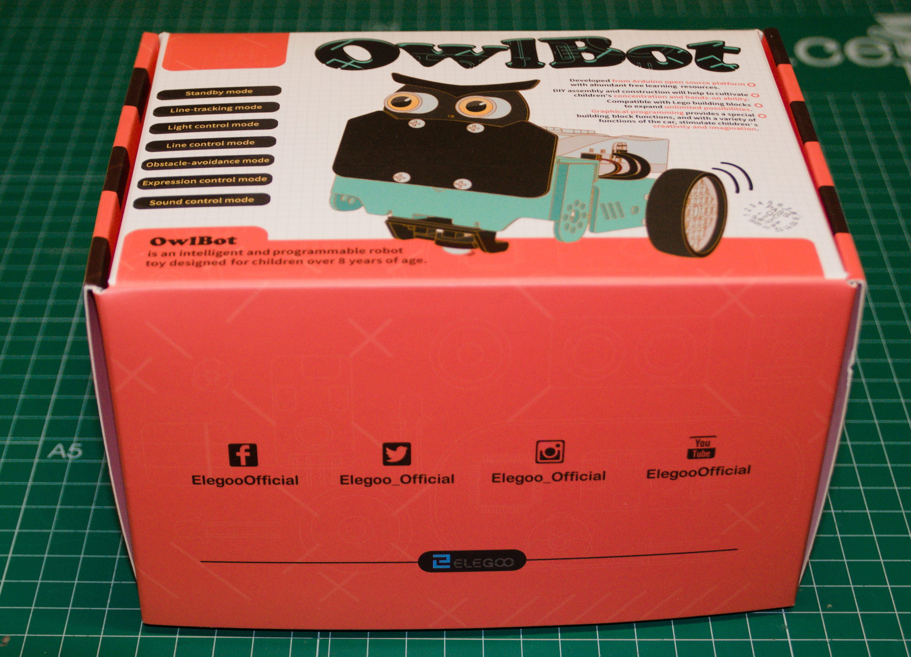

# OwlBot by Elegoo

[OwlBot robot by Elegoo](https://www.amazon.es/dp/B08GM4PD1L/ref=cfb_at_prodpg)

## Review by @javacasm

Buen kit para aprender a programar robots

Un buen kit que contiene todo lo necesario para aprender a programar robots desde cero:
* Incluye Un robot muy completo que se monta en 20 minutos pero con bastantes posibilidades.
* Contiene un tapete impreso que por un lado tiene un circuito para practicar con el robot y por el otro las instrucciones de montaje y uso del robot (en mi caso venían en ingles)
* Podemos descargar la documentación básica para el montaje está disponible en español y una documentación más amplia en inglés.
* Puesto que incluye conexión Bluetooth, el robot se puede controlar y programar con bloques desde un dispositivo Android. Este tipo de uso y programación resulta muy adecuado para niños de unos 10 años en adelante.
* La documentación incluye todos los detalles para una programación más avanzada usando el entorno Arduino. Para esto ya necesitamos un ordenador
* La carcasa del robot permite el acoplamiento con piezas compatibles con Lego, lo que aumenta sus posibilidades
* Al ser un robot basado en productos con licencia libre, se incluyen todos los detalles necesarios para modificarlo.

## Contenidos del kit

El robot tiene los siguientes componentes:
* Placa de control compatible con Arduino Nano
* Placa bluetooth
* 2 x motores
* 3x Sensores infrarrojos para  siguelíneas
* Sensor ultrasónico de distancia
* Pantalla con 8x16 leds
* 5 x Leds RGB
* Sensor de posicionamiento giróscopo y acelerómetro MPU6050

En definitiva un kit muy interesante para aprender a montar, usar y programar robots.

## Documentación oficial de Elegoo

[Manual, tutorial y ejemplos](https://drive.google.com/file/d/13FUqTivA_RfGHjeh0erjI6zpS5U_XPHi/view?usp=sharing)

[Videotutorial de montaje](https://youtu.be/Xy5gp_2OK6o)

[Videotutorial de uso](https://youtu.be/n7fB8AQVvWU)

[Otros ejemplos y proyectos](https://www.youtube.com/playlist?list=PLkFeYZKRTZ8YUgKljbfl9gMwxVUe_m-Sn)